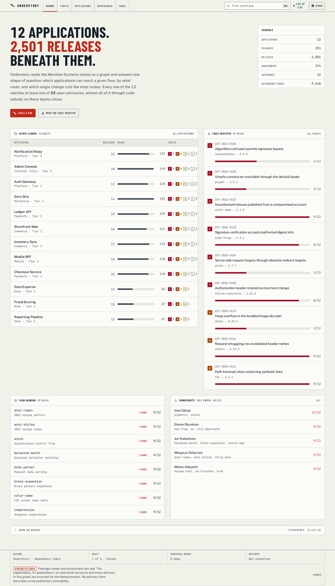
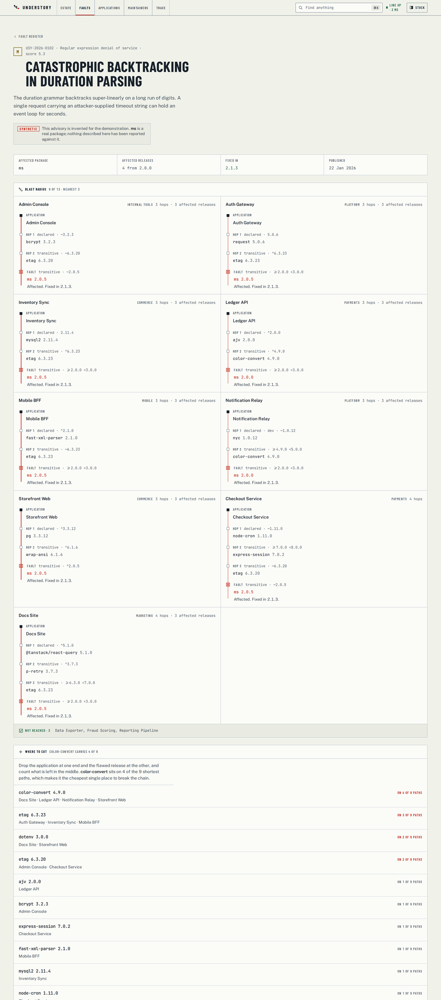
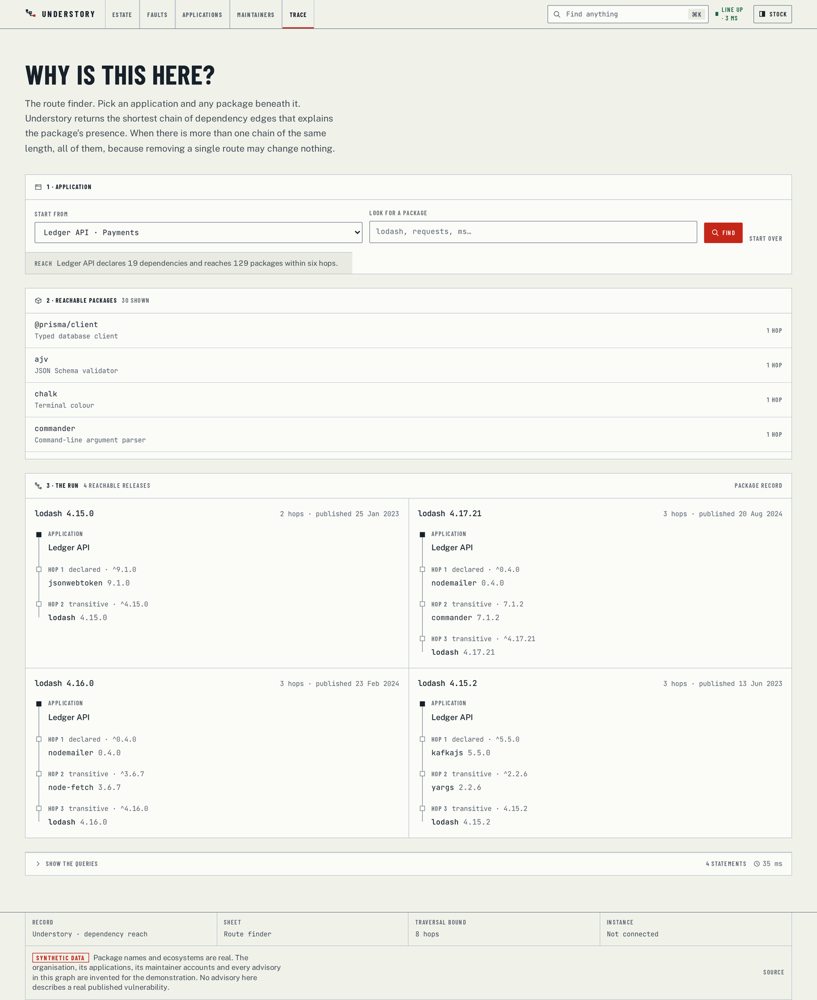
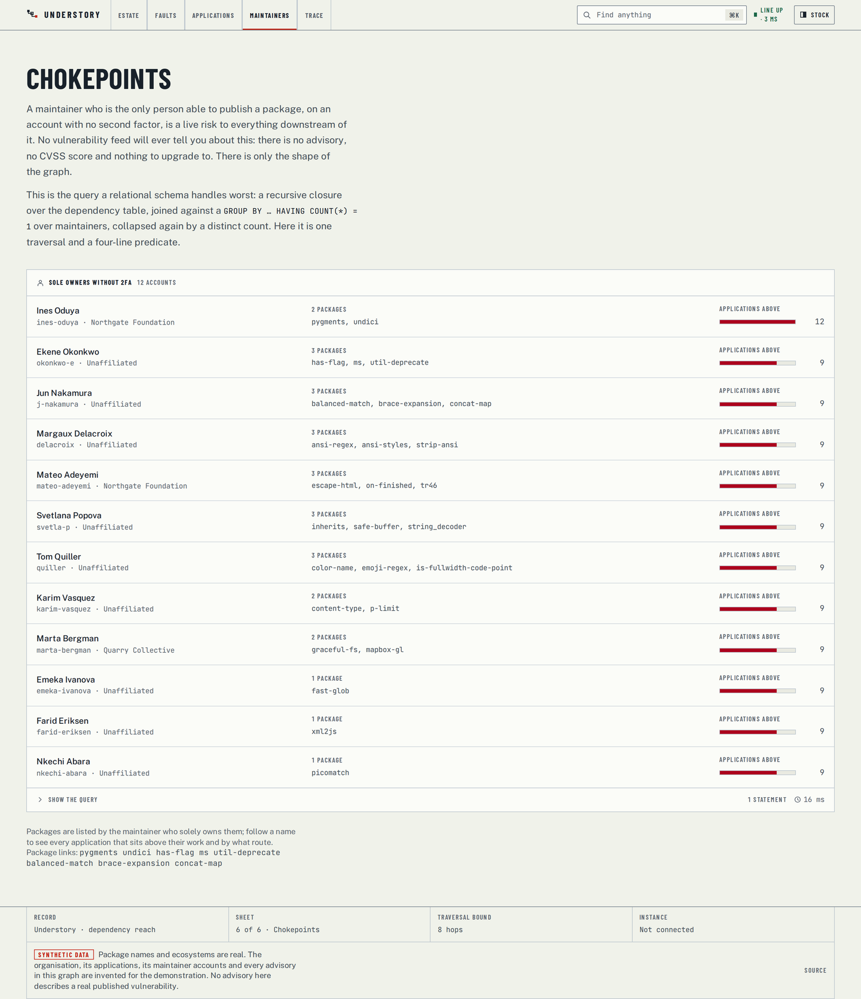
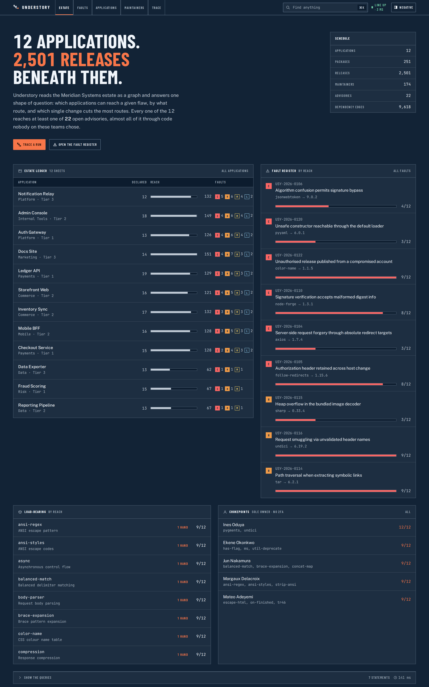
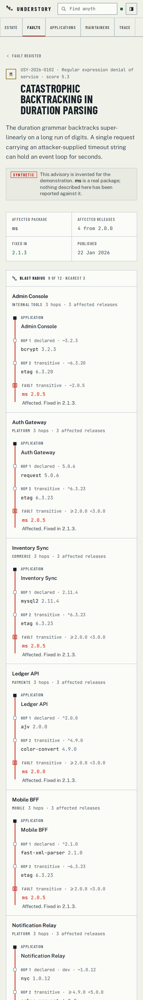
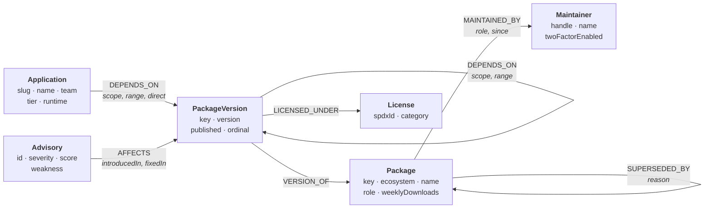

# Understory

**Trace the shortest dependency path from an application you own to code you didn't write — and find the one change that cuts it.**

A graph-database application built for the Wexa AI take-home. It models a
software organisation's dependency graph in **CognoDB** (openCypher over Bolt)
and answers reachability questions a table cannot answer well: _which of our
applications can reach this advisory, by what route, and what is the cheapest
place to break the chain?_

> **Live demo:** [under-story-pi.vercel.app](https://under-story-pi.vercel.app/)
> **Walkthrough video:** [Streamable (3 min take)](https://streamable.com/hcy1mq)
> **Author:** Ebube Ezediimbu · [@ISyncPlus](https://github.com/ISyncPlus)

---

## Why a graph database?

The estate in this demo is twelve applications standing on **2,501 releases of
251 packages**, joined by **9,618 dependency edges**. Everything worth asking
about it is a question about _paths_, and a path is exactly what a relational
schema cannot return.

Put the same data in Postgres and the schema is easy: `applications`,
`packages`, `package_versions`, `dependencies(from_id, to_id)`. The queries are
where it falls apart.

**"Which applications can reach an affected release of `ms`, and how far away is
it?"** In SQL this is a recursive CTE that walks `dependencies` outward from
every application, carrying an array of visited ids to avoid cycling, until it
either finds the target or exhausts a depth bound. Then, because the CTE yields
_every_ route rather than the best one, you group by application and take the
minimum length — and if you also want the winning route itself (which is the
entire point) you have to have carried the whole path array through every
iteration and de-duplicate it afterwards. In Cypher:

```cypher
MATCH route = shortestPath((application)-[:DEPENDS_ON*1..8]->(vulnerable))
```

One clause, and `shortestPath` with both endpoints bound is a bidirectional
breadth-first search: its cost is a function of the graph's size, not of how many
distinct routes exist between the two nodes. Between an application and a leaf
utility, that number is combinatorial — which is precisely why the recursive-CTE
version gets slow before it gets wrong.

**"Which single maintainer's account, if compromised, reaches the most of our
estate?"** No advisory will ever tell you this; it is purely a property of the
graph's shape. Relationally it is a recursive closure over `dependencies`,
joined against a `GROUP BY package HAVING COUNT(maintainer) = 1`, joined again
to filter on the account's 2FA flag, and finally collapsed by
`COUNT(DISTINCT application)` after a join that fans out across every
intermediate row. Here it is one traversal and a four-line predicate
([`maintainers.ts`](src/data/queries/maintainers.ts)).

**"Where is the cheapest place to cut?"** Take the shortest path from every
exposed application, drop the application at one end and the flawed release at
the other, and count what is left in the middle. In Cypher the path is a value
and the slice is a slice — `nodes(route)[1..-1]`. In SQL, paths are not values;
you materialise them as rows and self-join to strip the endpoints.

The honest counter-argument: at this scale (2,971 nodes) Postgres with a
well-indexed recursive CTE would answer most of these in acceptable time. The
argument for the graph is not raw speed at 3,000 nodes — it is that the queries
above are one readable statement each instead of forty lines of CTE that the
next engineer has to reverse-engineer, and that they stay one statement as the
estate grows from twelve applications to two hundred.

| Question                                                                       | Why a table struggles                                                                                 |
| ------------------------------------------------------------------------------ | ----------------------------------------------------------------------------------------------------- |
| Which applications reach an affected release, and how far away is it?          | Unbounded transitive closure, then a shortest path per pair, then the path itself as a returned value |
| Why is `lodash` in this build at all?                                          | You need the chain, not the membership test                                                           |
| Which sole maintainer sits under the most of the estate?                       | Recursive closure joined to a `HAVING COUNT(*) = 1`, then collapsed by a distinct count               |
| Which copyleft licence arrived through a fourth-level edge, and via which hop? | The answer _is_ the path                                                                              |

The [query walkthrough](docs/QUERIES.md) has every one of them in full.

---

## What it looks like

**The estate sheet.** Twelve applications as ruled rows, each with what it
declares, what it actually reaches, and the faults it can get to. Beside it, the
fault register ordered by reach rather than by severity, because "critical but
unreachable" is a different problem from "medium and under nine of twelve".



**The fault sheet.** For one advisory, the shortest dependency path from every
exposed application, drawn as a jumper run down the sheet — and, underneath,
which single package sits on the most of those paths.



**"Why is this here?"** Pick an application and any package beneath it. Four
different releases of `lodash` arrive by four different routes, which is the
answer a dependency _list_ structurally cannot give.



**Chokepoints.** Sole maintainers with no second factor, ranked by how much of
the estate sits above them. No advisory describes this; it is purely the shape
of the graph.



<table>
<tr>
<td width="50%" valign="top">

**The negative print.** A second theme, composed rather than mechanically
inverted: white linework on Prussian blue, the way a drawing comes back from the
reprographer.



</td>
<td width="50%" valign="top">

**On a phone.** The run diagram is vertical at every width on purpose — a
wrapped horizontal chain loses the one thing the drawing is for.



</td>
</tr>
</table>

---

## The data model



Six labels, seven relationship types, **2,971 nodes and 15,280 relationships**.

### The three decisions worth defending

**1. Dependencies are between _versions_, not packages.** A dependency graph
where `express → lodash` is an edge cannot answer "which release am I actually
on?" — and that is the only question that matters when an advisory names a
range. `Package` exists as the identity a human searches for; `PackageVersion`
is what the graph actually traverses.

**2. `PackageVersion` carries a denormalised `name` and `ecosystem`.** A returned
path is a list of version nodes. Without the duplicated string, rendering _"which
package is this hop?"_ would need one extra query per hop. The cost is a
duplicated string on 2,501 nodes; the benefit is that every path in the interface
comes back in a single round trip.

**3. The graph is a DAG by construction.** The catalogue assigns every package a
tier from 1 (application-facing framework) to 6 (leaf utility), and the builder
only ever draws an edge from a lower tier to a strictly higher one. That is not
cosmetic: it is what makes bounded variable-length traversal safe to run on a
0.5 vCPU instance, and it mirrors how registries actually stratify. Dependencies
also never cross ecosystems.

### Constraints and indexes

Six uniqueness constraints double as the lookup index for every natural key the
application queries by (`Application.slug`, `Package.key`, `PackageVersion.key`,
`Maintainer.handle`, `Advisory.id`, `License.spdxId`). Six further indexes back
the search and filter paths. All of it lives in
[`src/data/schema.ts`](src/data/schema.ts) and is applied idempotently by the
seed script.

---

## The main queries explained

All 22 read queries live in [`src/data/queries/`](src/data/queries), one module
per question, each carrying the plain-English purpose that the interface's
"Show the queries" disclosure displays. These four carry the product.

### 1. Blast radius — the headline multi-hop traversal

_Every application's shortest path to an affected release, including the
applications that have none._

```cypher
MATCH (:Advisory { id: $advisoryId })-[:AFFECTS]->(vulnerable:PackageVersion)
WITH collect(DISTINCT vulnerable) AS vulnerableReleases
MATCH (application:Application)
UNWIND vulnerableReleases AS vulnerable
OPTIONAL MATCH route = shortestPath((application)-[:DEPENDS_ON*1..8]->(vulnerable))
WITH application, vulnerable, route
ORDER BY length(route) ASC, vulnerable.ordinal DESC
WITH application, collect(CASE WHEN route IS NULL THEN null ELSE { … } END) AS routes
RETURN application.slug AS slug, size(routes) AS affectedReleasesReached, head(routes) AS best
ORDER BY CASE WHEN size(routes) = 0 THEN 1 ELSE 0 END ASC,
         coalesce(head(routes).route.depth, 99) ASC,
         application.name ASC
```

`OPTIONAL MATCH` keeps the unexposed applications in the result — _"not
reached"_ is an answer a reader needs, and dropping those rows would quietly
turn "nine of twelve" into "nine". `collect()` discards nulls, so the `CASE`
yields only real routes while the row survives.

### 2. Cut points — where the runs converge

_Which intermediate hop appears on the most shortest paths._

```cypher
… shortestPath as above …
WITH application, length(shortest) AS depth, nodes(shortest)[1..-1] AS junctions
UNWIND junctions AS junction
WITH junction, collect(DISTINCT { slug: application.slug, name: application.name, depth: depth }) AS applications
RETURN junction.name AS packageName, applications, size(applications) AS applicationCount
ORDER BY applicationCount DESC, packageName ASC
```

`nodes(shortest)[1..-1]` is the whole idea: index 0 is the application and the
last element is the fault, so the slice is exactly the hops in between. On the
`ms` advisory this surfaces `color-convert` as carrying four of nine paths —
one upgrade, four exposures removed.

### 3. Maintainer chokepoints — the query a table handles worst

_Sole maintainers without a second factor, ranked by downstream reach._

```cypher
MATCH (package:Package)-[:MAINTAINED_BY]->(maintainer:Maintainer)
WITH package, collect(maintainer) AS maintainers
WHERE size(maintainers) = 1 AND head(maintainers).twoFactorEnabled = false

WITH head(maintainers) AS maintainer, collect(package) AS packages
WITH maintainer, packages,
     reduce(weight = 0, item IN packages | weight + coalesce(item.weeklyDownloads, 0)) AS weight
ORDER BY weight DESC
LIMIT $candidateLimit

UNWIND packages AS package
MATCH (version:PackageVersion)-[:VERSION_OF]->(package)
MATCH (application:Application)-[:DEPENDS_ON*1..6]->(version)
WITH DISTINCT maintainer, package, application
RETURN maintainer.handle AS handle,
       count(DISTINCT package) AS packageCount,
       count(DISTINCT application) AS applicationCount
ORDER BY applicationCount DESC, packageCount DESC
LIMIT $limit
```

Two bounds keep it honest on a 0.5 vCPU instance: candidates are ranked by how
load-bearing their packages are and cut to `$candidateLimit` _before_ the
traversal runs, and the traversal itself stops at six hops. `WITH DISTINCT`
immediately after the expansion is what lets an engine with pruning expansion
skip duplicate paths rather than enumerate them.

### 4. Reciprocal licence exposure — when the answer is the path

_Copyleft licences reachable from one application, with the chain that
introduced each._

```cypher
MATCH (application:Application { slug: $slug })
MATCH (license:License) WHERE license.category IN $categories
MATCH (version:PackageVersion)-[:LICENSED_UNDER]->(license)
MATCH route = shortestPath((application)-[:DEPENDS_ON*1..8]->(version))
WITH license, version, route
ORDER BY length(route) ASC, version.name ASC
WITH license, count(DISTINCT version.name) AS packagesReached,
     head(collect({ route: …, packageName: version.name, version: version.version })) AS nearest
RETURN license.spdxId AS spdxId, packagesReached, nearest
ORDER BY CASE license.category
           WHEN 'network-copyleft' THEN 0 WHEN 'strong-copyleft' THEN 1 ELSE 2 END ASC,
         packagesReached DESC
```

An application's own licence is a single field. Whether it is _compatible_ with
what it ships is a property of everything beneath it — and the useful answer is
not "you have an AGPL dependency" but "here is the four-hop chain that
introduced it".

---

## Running it

### 1. Install

```bash
git clone https://github.com/ISyncPlus/understory.git
cd understory
npm install
```

Node 20.9 or newer.

### 2. See the interface immediately (no database needed)

```bash
npm run dev:fixtures     # http://localhost:3000
```

This resolves the data layer to an in-memory stand-in that answers every query
from the same dataset the seed script writes. It exists so the interface can be
developed and reviewed before an instance is provisioned. **A normal build never
touches it** — see [Fixture mode](#fixture-mode) below.

### 3. Connect a real database

```bash
cp .env.example .env.local
# fill in NEO4J_URI and NEO4J_PASSWORD from the CognoDB console
npm run db:check         # confirms the environment, the host, and the credentials
npm run db:seed          # loads 2,971 nodes and 15,280 relationships
npm run dev              # http://localhost:3000
```

**[docs/SETUP-COGNODB.md](docs/SETUP-COGNODB.md) walks through creating the
instance, step by step.** Every value you have to copy out of the console is
called out there.

Prefer to run the database locally? `docker compose up -d` starts a
Bolt-compatible Neo4j on `bolt://localhost:7687`; the compose file has the two
environment lines to paste.

---

## Commands

| Command                       | What it does                                                                              |
| ----------------------------- | ----------------------------------------------------------------------------------------- |
| `npm run dev`                 | Development server against the configured database                                        |
| `npm run dev:fixtures`        | Development server against the in-memory fixture graph                                    |
| `npm run build` / `npm start` | Production build and serve                                                                |
| `npm run db:check`            | Connectivity doctor: environment → host → credentials → graph contents                    |
| `npm run db:seed`             | Load the graph (idempotent)                                                               |
| `npm run db:reset`            | Delete everything, then load                                                              |
| `npm run data:verify`         | Build and validate the dataset without writing anything                                   |
| `npm run cypher:check`        | Parse every Cypher statement in the repo; fail on a syntax error or an interpolated value |
| `npm run typecheck`           | `tsc --noEmit`, strict                                                                    |
| `npm run verify`              | All three checks above, in order                                                          |
| `npm run shots`               | Capture the interface into `.review/` (needs a server on :3100)                           |

---

## How it is put together

```
src/
├── lib/
│   ├── env.ts              Connection config. Validated lazily, so `next build`
│   │                       never needs production secrets.
│   ├── errors.ts           One vocabulary for every failure, and the classifier
│   │                       that maps driver errors onto it.
│   ├── neo4j.ts            Driver lifecycle, the read() helper, health probe.
│   └── neo4j.fixture.ts    Fixture stand-in (development only).
├── data/
│   ├── model.ts            Domain types. Everything crossing the query boundary
│   │                       is a plain object — a driver Node cannot be handed to
│   │                       a Client Component.
│   ├── catalog.ts          251 real package names, tiered.
│   ├── advisories.ts       22 authored advisories.
│   ├── organisation.ts     12 applications, maintainer identities.
│   ├── build-graph.ts      Deterministic graph builder + self-verification.
│   ├── schema.ts           Constraints, indexes, and every write statement.
│   └── queries/            One module per question. 22 read queries.
├── components/             Sheet primitives, the run diagram, the query
│                           disclosure, designed failure states.
└── app/                    Routes. Server Components read directly; two Route
                            Handlers serve the client-side search and health probe.
```

### Server Components read the database directly

Pages are async Server Components that call the query layer straight, with no
intermediate HTTP hop. Only the two genuinely interactive pieces — typeahead
search and the connection lamp — go through Route Handlers (`/api/search`,
`/api/health`), because those _are_ client-initiated.

The alternative (an HTTP API in front of every page) would add a second
serialisation boundary, a second place for types to drift, and a network round
trip inside our own process. Where a real API is warranted — a mobile client, a
third party — the query layer is already the seam it would sit on.

### Every value is a parameter

There is no code path in this repository that concatenates a value into a Cypher
string, including in the seed script. The two things interpolated into a query
are the traversal bounds (`PATH_DEPTH = 8`, `REACH_DEPTH = 6`) — Cypher does not
accept a parameter for a variable-length bound — and a shared route projection.

`npm run cypher:check` enforces this. It scans every Cypher template in the
repo, rejects any interpolation that is not one of those structural constants,
and parses all 49 statements with
[`@neo4j-cypher/language-support`](https://www.npmjs.com/package/@neo4j-cypher/language-support),
the ANTLR grammar behind Neo4j's own editor tooling. A typo fails the check
instead of failing in front of a reviewer.

### Two traversal bounds, for two shapes of query

- **`shortestPath` (bound 8 hops)** — both endpoints are bound, so this is a
  bidirectional breadth-first search. Its cost depends on the size of the graph,
  not on how many distinct routes exist between the two nodes; between an
  application and a leaf utility, that number is combinatorial.
- **Set traversals (bound 6 hops)** — "everything this application can see".
  Always written with `DISTINCT` immediately after the expansion, so an engine
  with pruning expansion can skip duplicate paths instead of enumerating them.

The deepest shortest path in the seeded graph is 6 hops, so neither bound
truncates a real answer. They exist to keep a pathological query from ever
reaching a burstable instance.

### The failure states are designed

A free-tier instance is sometimes asleep, sometimes slow, sometimes not
configured at all. Query functions return a discriminated `Outcome<T>` rather
than throwing, so each surface renders a _named_ state — `unconfigured`,
`unreachable`, `unauthorized`, `timeout`, `query`, `unknown` — with the specific
recovery for that cause. Nothing shows a stack trace, and nothing shows a blank
sheet. Driver messages are sanitised before they can reach a response body, so a
host or credential can never leak into an error string.

### The query is part of the product

Every panel can reveal the exact statement that produced it, the parameters bound
to it, the record count, and the server round-trip. It is read-only — a record of
what ran, not an input — so there is no path from that control back into the
database. It is there because a result you cannot inspect is a result you have to
take on trust.

---

## The dataset

Package names and ecosystems are **real**. The organisation, its applications,
its maintainer accounts and **every advisory are invented** for this
demonstration and labelled as such wherever a reader could mistake them for
published records. Advisories carry a `USY-` prefix precisely so they cannot be
confused with GHSA or CVE identifiers.

The builder is deterministic — one integer seed, no clock, no randomness that
isn't derived from it — so the figures in this README, the screenshots and the
demo all agree, and a reviewer who re-runs `npm run db:seed` next week gets the
same graph.

It also **verifies itself**. Before anything is written, the builder walks the
graph it just produced with the same breadth-first traversal the Cypher performs,
and asserts that the advisories this demo is built around still reach the number
of applications the dataset claims. A fixture that quietly stops demonstrating
anything is worse than no fixture. Shortest-path depths across the built graph:

| Depth                        | 1   | 2   | 3     | 4     | 5   | 6   |
| ---------------------------- | --- | --- | ----- | ----- | --- | --- |
| (application, release) pairs | 181 | 916 | 1,844 | 1,223 | 237 | 23  |

---

## Fixture mode

`UNDERSTORY_FIXTURES=1` makes `next.config.ts` rewrite the `@/lib/neo4j`
import to an in-memory module. Two things about it are deliberate:

1. **It fabricates driver _records_, not application data.** Each fixture
   returns rows shaped exactly like the columns the real Cypher returns, and the
   query module's own `map` function runs over them unchanged — so the mapping
   layer, the part most likely to be wrong, is exercised by every fixture run
   rather than mocked away.
2. **A production build never sees it.** The alias is applied only when the
   environment variable is set; `npm run build` resolves the real Bolt driver.

It is how the interface was built and reviewed before an instance existed, and it
is why you can `git clone && npm install && npm run dev:fixtures` and see the
whole application in thirty seconds.

---

## Accessibility and responsiveness

- Every finding is reachable without the run diagram; the diagram is an aid, not
  the only route to an answer.
- Severity is carried three ways at once — a letter, a fill weight and a colour —
  so it survives a monochrome print, a colour-blind reader, and a screenshot
  pasted into a ticket.
- Every foreground/background pair in both themes was measured against WCAG AA
  (4.5:1 body, 3:1 controls) rather than eyeballed.
- Filter state lives in the URL, so any view can be sent to somebody else.
- The interface was scanned with a design anti-pattern detector at every
  viewport; see [DESIGN.md](DESIGN.md) for what the visual system is and why.

---

## Documentation

- **[docs/SETUP-COGNODB.md](docs/SETUP-COGNODB.md)** — create the instance and load the graph, step by step
- **[docs/QUERIES.md](docs/QUERIES.md)** — every query, what it answers, and why the graph earns it
- **[docs/DEPLOY.md](docs/DEPLOY.md)** — deploy the hosted demo on Vercel
- **[DESIGN.md](DESIGN.md)** — the visual system, recorded from the built interface
- **[PRODUCT.md](PRODUCT.md)** — product truth: who this is for and what it must never fake

---

## Licence

MIT. See [LICENSE](LICENSE).
